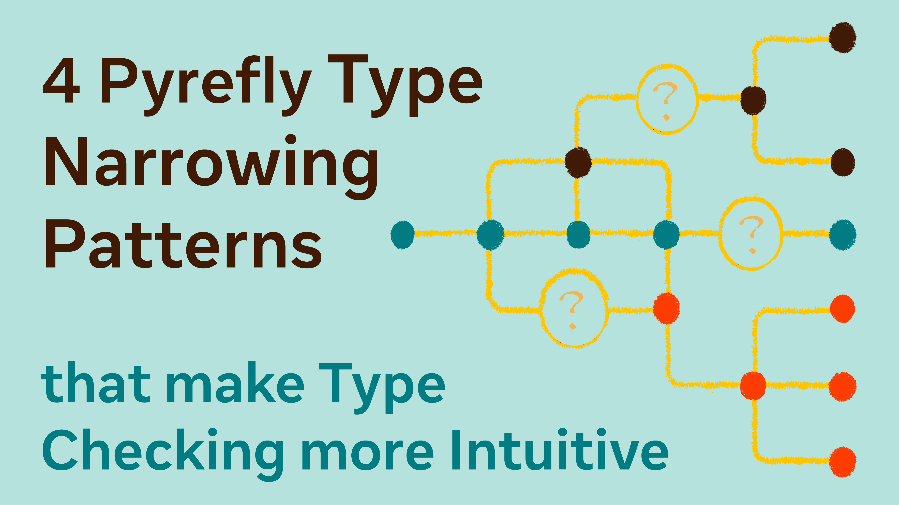

If we view a type of an expression or variable as the set of possible values it can resolve to,  narrowing is the process of applying constraints on those values. For example, if you have a variable `x` whose contents you don’t know, an `if isinstance(x, int)` check will narrow the type of `x` to `int` inside the body of the if-statement.

Since Python is a [duck-typed](https://en.wikipedia.org/wiki/Duck_typing) language, programs often narrow types by checking a structural property of something rather than just its class name. For a type checker, understanding a wide variety of narrowing patterns is essential for making it as easy as possible for users to type check their code and reduce the amount of changes made purely to “satisfy the type checker”.

In this blog post, we’ll go over some cool forms of narrowing that Pyrefly supports, which allows it to understand common code patterns in Python.

<!-- truncate -->

## `hasattr` and `getattr`

In a dynamic codebase where not every field is initialized in the constructor, you may encounter code that dynamically adds attributes to classes without declaring them in the class body.

Even if a field is not declared on the class, Pyrefly can understand a `hasattr` check indicates that the field exists.

```python
def func(x: object) -> None:

   if hasattr(x, "value"):
       val = x.value # Pyrefly knows that `x` has the `value` attribute and won’t error here
```

Some fields are declared on the class but not always initialized, so accesses have to be done with `getattr`. To support this pattern, any checks on `getattr(x, “field”)` will generally narrow the type the same way as the same check on `x.field`. This means that using `getattr()` in a guard will narrow the field to be truthy.

```python
from typing import Literal, assert_type

class C:
    flag: bool  # the flag is not always set`

def func(x: C) -> None:

   if getattr(x, "flag"):
       # here Pyrefly knows that the flag is set to True
       assert_type(x.flag, Literal[True])
```

## Tagged Unions

[Tagged unions](https://en.wikipedia.org/wiki/Tagged_union) are a common feature in functional programming languages, but they are not a first-class language construct in Python.  Although Python’s union types are untagged, Pyrefly can emulate a tagged union by creating a union where each member explicitly defines the same field to use as a tag. Pyrefly can then check the value of the field to narrow the union to the corresponding member.

This works for regular classes, as well as typed dicts.

```python
from typing import TypedDict, Literal

class Ok(TypedDict):
   result: Literal["ok"]
   payload: bytes

class Err(TypedDict):
   result: Literal["error"]
   message: str

type Response = Ok | Err

def read(res: Response) -> bytes:
   if res["result"] == "ok":
        return res["payload"]
   else:
       raise Exception(res["message"])
```

## Tuple length narrowing

When you check the length of something against a literal integer, Pyrefly will narrow away any tuple types that definitely do not match that length:

```python
from typing import assert_type

type XY = tuple[float, float]   # 2D point
type RGB = tuple[int, int, int]  # color

type Vec = XY | RGB

def describe(v: Vec) -> None:
   if len(v) == 2:
       x, y = v # Pyrefly knows v only has 2 elements, so it cannot be RGB
   else:
       r, g, b = v # Pyrefly knows v has 3 elements, so it cannot be XY
```

## Conditions saved in variables

If you want to check some condition multiple times, you may want to save it to a local variable to avoid repeating yourself. Pyrefly understands this pattern, while also being smart enough to figure out when it should invalidate a saved condition:

```python
def f(x: int | str, y: int, z: int | str):

    x_is_int = isinstance(x, int)

    if x_is_int:
        y += x # here Pyrefly knows x is an int and won't throw an error

    if x_is_int:
        y += x # x has not changed, so pyrefly still knows that x is an int

    x = z

    if x_is_int:
        y += x # this is now unsafe, the x_is_int condition is invalidated so pyrefly will throw an error here
```

## Conclusion

These are just a few of the ways Pyrefly automatically narrows types, reducing the need for explicit casts in your programs. Not all of these features are unique to Pyrefly, but no other type checker as of writing supports the full set of narrowing patterns listed here. Given the lack of standardization of this feature, there’s a lot of room for innovation in the space. We’re currently working on expanding the narrowing patterns we support - so stay tuned for more updates!

Do you have a pattern for narrowing types that you wish type checkers could understand, or that you want us to support in Pyrefly? Please file an issue on our [Github](https://github.com/facebook/pyrefly)!
