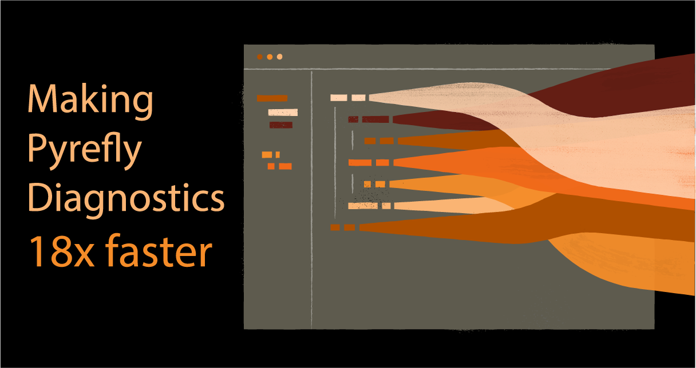
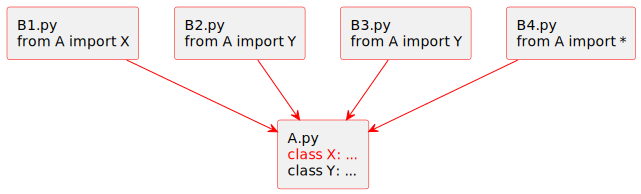
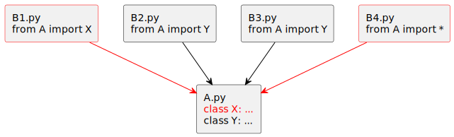
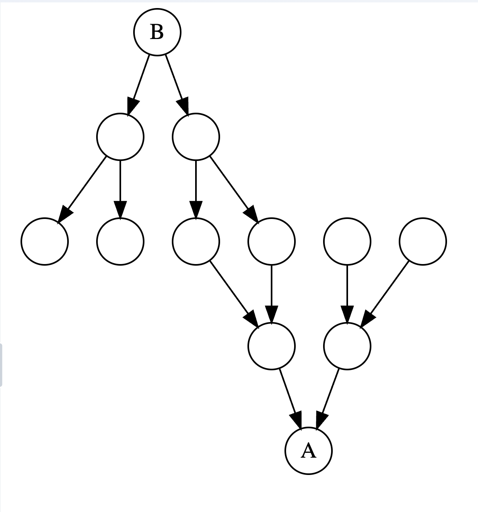
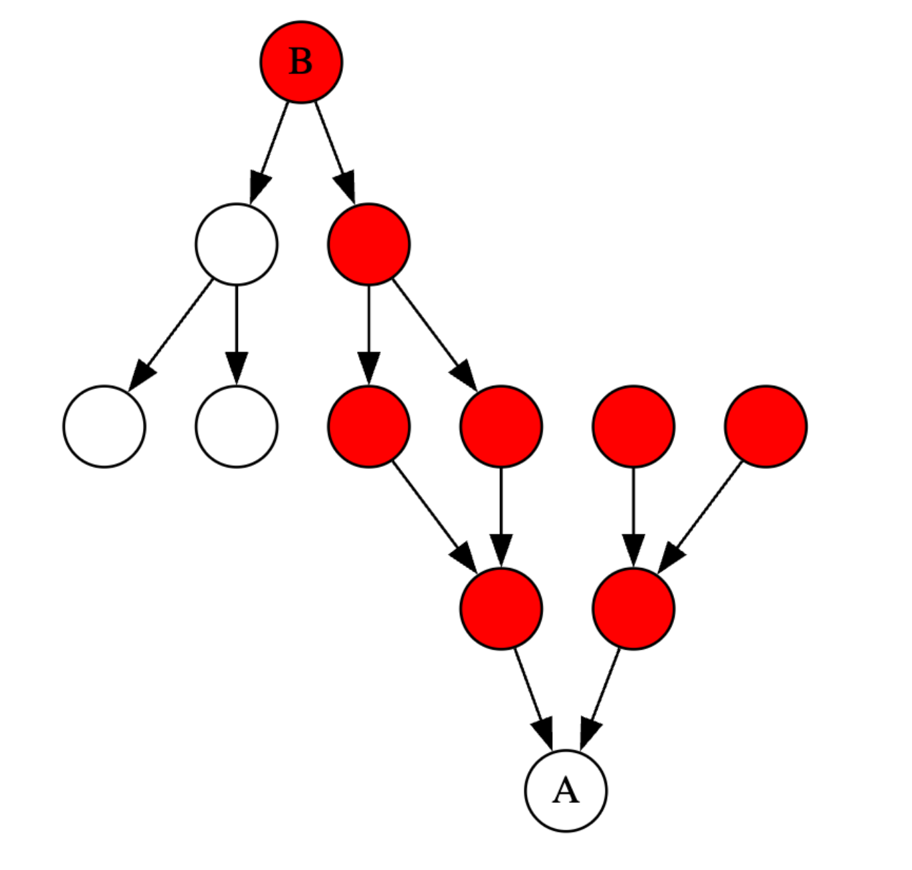
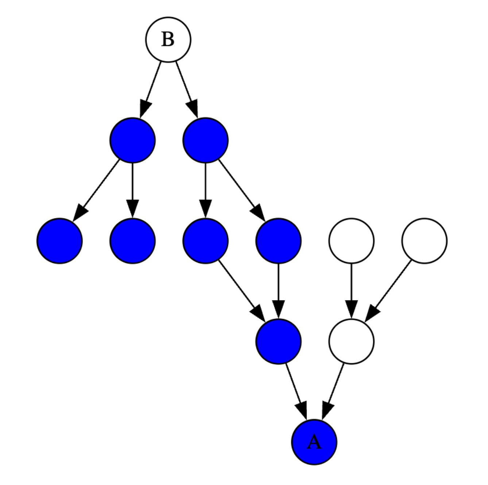
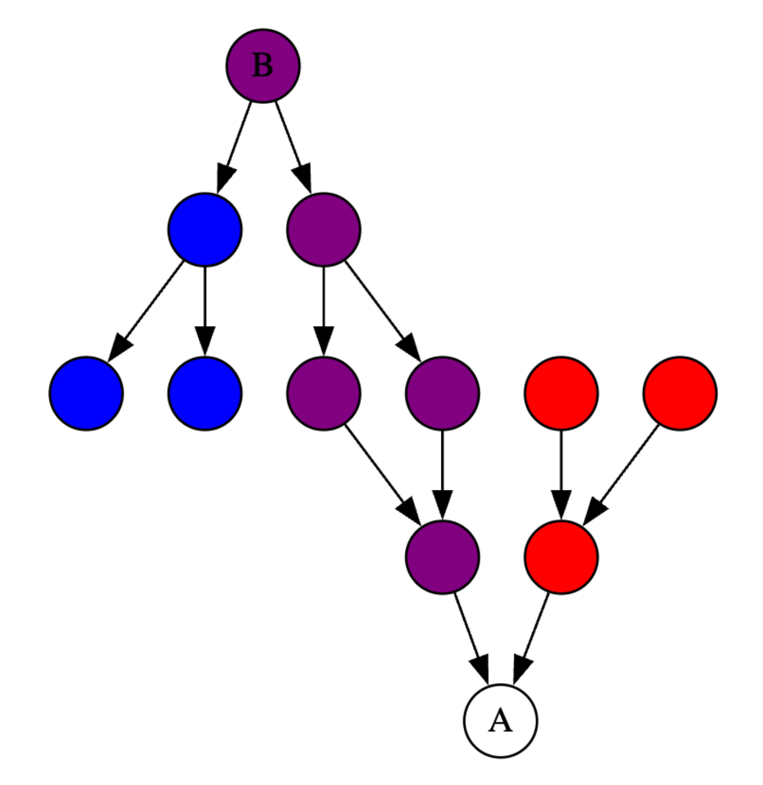

As we move closer to a stable release of Pyrefly, our efforts have moved from expanding the language server’s capabilities to tackling performance edge cases. Recently, our friends at Astral [alerted us to a specific edge case](https://astral.sh/blog/ty) that is a great example of the kind of issues we’ve been aiming to uncover. The specific example Astral highlighted showed that in some edge cases Pyrefly could take multiple seconds to update diagnostics after editing. This is much slower than expected (used across Meta’s codebases, Pyrefly usually takes less than 10 milliseconds to recheck files after saving them) and prompted us to investigate further.

Now we’d like to share the story of how that edge case led us to rethink our underlying approach to diagnostics and dependency tracking, improving the speed at which Pyrefly's type errors update by 18x in the process.

<!-- truncate -->


## The Problem

Say you’re working in a very large codebase and have two files open in your editor, A and B.

- A is a “load-bearing” file that has many reverse dependencies \- that is to say, many files directly or transitively import A.
- B is one of the files that imports A.

Incremental type checking should be snappy \- when you edit A and save the file, any effects on the type errors in B should be reflected almost instantly. However, in a small number of cases, we found that updates could take multiple seconds.

### How Incremental Updates Work in Pyrefly

To understand how this problem arises, we need to look at how incremental updates currently work. Pyrefly’s analysis operates at the module level, meaning it keeps track of the types exported from each module, as well as the dependencies between modules. Let’s illustrate with a simple example.



The above image demonstrates a file A that has 4 reverse-dependencies. B1-B4 all rely on the types exported from A.

When file A is edited & saved, we recheck A to see if any of its exported types also change. If so, we recheck every file that imports A (and if any of those files’ exports changed, we recheck their dependencies, and so on until the change to A has been successfully propagated everywhere). After all of that finishes, we display updated errors in the IDE.

There are two key observations here:

1. Our dependency tracking rechecks a module when *any* export changes, even if the module does not depend on the export that changed. This can lead to modules being rechecked unnecessarily.
2. We are waiting until the update has completely propagated to every affected file before sending any updated diagnostics, when in practice we mostly care about the files the user has open.

## Solution 1: Fine-grained dependency tracking

Instead of just tracking whether or not a module depends on another module for invalidation, we can specifically track what’s used.

Looking again at the example above, instead of rechecking everything that imports A, with smarter dependency tracking we could only recheck a subset of relevant files:



But the types a module depends on are not only from imports. Imagine a program like this with a chained method call:

```py
from module import Class
Class().returns_type().operation_on_type()
```

Even though we only import `Class`, this module still depends on the type returned in `returns_type()`.

Similarly, `returns_type()` could be implemented in a `base` of `Class`, so we really might be depending on a class hierarchy instead of just `Class` from `module`.

And should a change to an unrelated part of numpy invalidate this program (i.e. recheck the module)? Probably not.

```py
import numpy as np
array = np.ones(1)
```

As you can see, a program’s type dependency structure is much more complicated and expansive than it might originally appear.

Since Pyrefly v0.51.1, we no longer invalidate a module any time a dependency changes. We now track exactly which types the module depends on at lookup to prune the modules that must be recomputed. In load-bearing files like the example in the introduction, this change turns what could be a 2000+ module invalidation into an invalidation of just over 100 modules.

## Solution 2: Streaming diagnostics

The other key insight from earlier is that we’re waiting for the update to finish completely before refreshing the errors in the IDE. To improve this, we could stream updated diagnostics to the IDE as soon as an open file has been rechecked, without waiting for other modules to be rechecked.

Let’s imagine a project with a dependency structure that looks like this. A is the file that we are editing, and B is another file that we have open, which is affected by edits to the types in A. As a user, what we want is for changes we make in A to be reflected in B with minimal delay.




Highlighted in red are the reverse dependencies of A, which may need to be rechecked if A is updated. Previously, we would recheck all the red modules before updating the diagnostics for B.



Highlighted in blue are the transitive dependencies of B. Only changes to those modules affect the types and diagnostics for B.



The image below shows the intersection of A’s reverse dependencies and B’s dependencies in purple. Once those modules are checked, we can show updated diagnostics for open files to the user, while continuing to check the remaining modules (red) in the background.



In order to provide a smooth IDE experience, Pyrefly runs language server operations (e.g. hover, autocomplete, go-to-def) on one thread and rechecks on another thread,  that way users can still use language server features while a recheck is happening in the background. Previously, the main language server thread would send updated diagnostics to the IDE, and only did so once it received a signal from the recheck thread that a recheck had finished. Now with streaming diagnostics in Pyrefly v0.52.0, the recheck thread can emit the diagnostics to the frontend directly.

This change means that diagnostics can now be emitted from both the main thread and the recheck thread. To prevent conflicts between diagnostics sent from different threads, we add a restriction so that only one thread may send diagnostics for a given file at a given time. When a recheck is ongoing, the main thread cannot send diagnostics for any files eligible for streaming diagnostics.

## Results

Combined, these two optimizations enable Pyrefly to provide updated diagnostics 18x faster than before. Going back to the example from the introduction, these changes reduce the diagnostic update time from ~3.6 seconds to under 200ms on an M4 Macbook Pro. For users, this means type errors refresh instantly after saving a file, a dramatic improvement:

<video
    src="/videos/18x_faster.mp4"
    width="720"
    muted
    loop
    autoPlay
    playsInline
    preload="auto"
  ></video>

To see how we benchmarked this, you can check out testing instructions on GitHub [here](https://github.com/facebook/pyrefly/pull/2344)

## What’s Next?

This was a tricky case to fix and we’ve made significant progress, but how fast is fast enough?

Speed continues to be a top priority for us on the Pyrefly team. While we’ve addressed the core problem, we’re always on the lookout for opportunities to further optimize performance, so stay tuned for further updates and make sure to regularly update your Pyrefly version. As we move toward v1, we’re carefully weighing additional speed improvements alongside other critical priorities like memory efficiency, bug fixes, and enhanced inference capabilities. Our goal is to deliver the fastest experience possible without compromising on overall functionality.

As always, if you’ve found a problem, please let us know by [opening a GitHub issue](https://github.com/facebook/pyrefly/issues).

And if you’ve made it this far, thanks for journeying down this rabbit hole with us\! We hope you give Pyrefly a try if you haven’t already, see you for the next update\!
